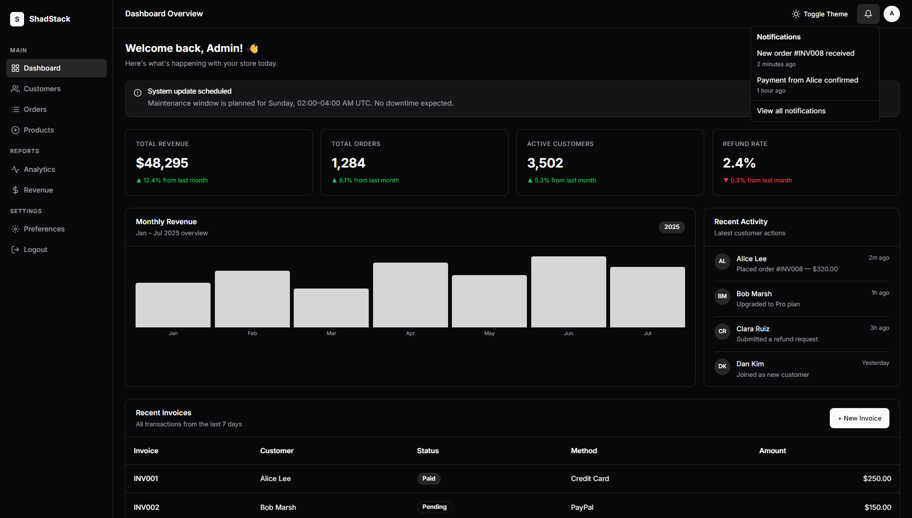

# ShadStack UI

A lightweight, zero-dependency UI component library for the modern web. Components are built with pure HTML, CSS, and Vanilla JS — no bundler, no framework, no build step required.



---

## Overview

ShadStack UI ships as two static files:

| File | Purpose |
|---|---|
| `ui.min.css` | All component styles and CSS custom property theming |
| `ui.min.js` | Interactive behaviours — modals, dropdowns, accordions, tabs, and more |

---

## Installation

Add the following two lines to your HTML `<head>`:

```html
<link href="https://your-cdn.com/ui.min.css" rel="stylesheet" />
<script src="https://your-cdn.com/ui.min.js" defer></script>
```

### Local Development

The repository includes a Next.js documentation site that serves the assets from its `public` directory.

```bash
git clone https://github.com/your-org/shadstack-ui
cd shadstack-ui/ui-framework
npm install
npm run dev
```

Assets are then available at:

- `http://localhost:3000/ui.min.css`
- `http://localhost:3000/ui.min.js`

---

## Theming

ShadStack UI uses CSS custom properties for all colors, radii, and shadows. Light and dark themes are both included.

**Toggling the theme at runtime:**

```js
ShadUI.toggleTheme();
```

**Setting the theme via markup:**

```html
<html data-theme="dark">
<html data-theme="light">
```

**Overriding tokens in your own stylesheet:**

```css
:root {
  --primary: #6366f1;
  --bg-color: #0f0f11;
  --radius-md: 0.75rem;
}
```

**Token Reference:**

| Token | Light | Dark | Description |
|---|---|---|---|
| `--bg-color` | `#ffffff` | `#09090b` | Page background |
| `--text-color` | `#000000` | `#fafafa` | Primary text |
| `--text-muted` | `#3f3f46` | `#a1a1aa` | Secondary / hint text |
| `--border-color` | `#e4e4e7` | `#27272a` | Default border |
| `--primary` | `#18181b` | `#fafafa` | Primary accent |
| `--primary-fg` | `#fafafa` | `#18181b` | Text on primary |
| `--muted` | `#f4f4f5` | `#27272a` | Subtle backgrounds |
| `--destructive` | `#ef4444` | `#7f1d1d` | Danger / error |
| `--radius-md` | `0.5rem` | — | Default border radius |
| `--shadow-md` | layered blur | — | Card and dropdown shadow |

---

## Components

26 components included.

| Component | Primary Classes | JS Required |
|---|---|---|
| Accordion | `.accordion`, `.accordion-item`, `.accordion-trigger`, `.accordion-content` | Yes |
| Alert | `.alert`, `.alert-icon`, `.alert-title`, `.alert-desc`, `.alert-destructive` | No |
| Alert Dialog | `.alert-dialog`, `.alert-dialog-header`, `.alert-dialog-footer` | Yes |
| Avatar | Utility classes | No |
| Badge | `.badge`, `.badge-default`, `.badge-secondary`, `.badge-outline`, `.badge-destructive` | No |
| Breadcrumb | Semantic `<ol>` with `.breadcrumb-sep` | No |
| Button | `.btn`, `.btn-primary`, `.btn-secondary`, `.btn-outline`, `.btn-ghost`, `.btn-destructive` | No |
| Card | `.card`, `.card-header`, `.card-title`, `.card-description`, `.card-content`, `.card-footer` | No |
| Checkbox | `.checkbox` | No |
| Dialog | `.modal-overlay`, `.modal-content`, `.modal-title`, `.modal-desc` | Yes |
| Dropdown Menu | `.dropdown`, `.dropdown-menu`, `.dropdown-item`, `.dropdown-label`, `.dropdown-separator`, `.dropdown-shortcut` | Yes |
| Field | `.field`, `.field-desc` | No |
| Input | `.input` | No |
| Popover | `.popover-group`, `.popover` | Yes |
| Progress | Utility layout | No |
| Radio Group | `.radio` | No |
| Select | `.select-group`, `.select-trigger`, `.select-dropdown`, `.select-item` | Yes |
| Skeleton | `.skeleton` | No |
| Slider | `.slider` | No |
| Switch | `.switch`, `.switch-thumb` | Yes |
| Table | `.table-container`, `.table` | No |
| Tabs | `.tabs`, `.tab-list`, `.tab-trigger`, `.tab-content` | Yes |
| Textarea | `.textarea` | No |
| Toast | `.toast-container`, `.toast` | Yes |
| Tooltip | `.tooltip-group`, `.tooltip` | No |
| Typography | Utility heading classes | No |

---

## Usage Examples

### Button

```html
<button class="btn btn-primary">Primary</button>
<button class="btn btn-secondary">Secondary</button>
<button class="btn btn-outline">Outline</button>
<button class="btn btn-ghost">Ghost</button>
<button class="btn btn-destructive">Destructive</button>
```

### Alert

```html
<div class="alert">
  <svg class="alert-icon" viewBox="0 0 24 24"><!-- icon --></svg>
  <h5 class="alert-title">Payment successful</h5>
  <div class="alert-desc">Your payment has been processed.</div>
</div>

<div class="alert alert-destructive">
  <svg class="alert-icon" viewBox="0 0 24 24"><!-- icon --></svg>
  <h5 class="alert-title">Payment failed</h5>
  <div class="alert-desc">Please check your payment method.</div>
</div>
```

### Alert Dialog

```html
<button data-ui-toggle="modal" data-ui-target="#confirm-dialog">Delete</button>

<div class="modal-overlay" id="confirm-dialog">
  <div class="alert-dialog">
    <div class="alert-dialog-header">
      <h2 class="alert-dialog-title">Are you absolutely sure?</h2>
      <p class="alert-dialog-desc">This action cannot be undone.</p>
    </div>
    <div class="alert-dialog-footer">
      <button class="btn btn-outline" data-ui-dismiss="modal">Cancel</button>
      <button class="btn btn-destructive" data-ui-dismiss="modal">Delete</button>
    </div>
  </div>
</div>
```

### Accordion

```html
<div class="accordion" data-ui-accordion-type="single">
  <div class="accordion-item">
    <button class="accordion-trigger" data-ui-toggle="accordion" aria-expanded="false">
      What are your shipping options?
      <svg class="accordion-icon" viewBox="0 0 24 24"><!-- chevron --></svg>
    </button>
    <div class="accordion-content">
      We offer standard (5-7 days), express (2-3 days), and overnight shipping.
    </div>
  </div>
</div>
```

### Dialog

```html
<button data-ui-toggle="modal" data-ui-target="#my-modal">Open Dialog</button>

<div class="modal-overlay" id="my-modal">
  <div class="modal-content">
    <h2 class="modal-title">Edit Profile</h2>
    <p class="modal-desc">Make changes to your profile below.</p>
    <button data-ui-dismiss="modal">Close</button>
  </div>
</div>
```

### Dropdown Menu

```html
<div class="dropdown">
  <button data-ui-toggle="dropdown" class="btn btn-outline">Open</button>
  <div class="dropdown-menu">
    <div class="dropdown-label">My Account</div>
    <div class="dropdown-item">
      <span>Profile</span>
      <span class="dropdown-shortcut">Shift+Cmd+P</span>
    </div>
    <div class="dropdown-separator"></div>
    <div class="dropdown-item disabled"><span>API</span></div>
    <div class="dropdown-separator"></div>
    <div class="dropdown-item">
      <span>Log out</span>
      <span class="dropdown-shortcut">Shift+Cmd+Q</span>
    </div>
  </div>
</div>
```

### Field

```html
<div class="field">
  <label class="label">Email address</label>
  <input type="email" class="input" placeholder="me@example.com" />
  <p class="field-desc">We will never share your email.</p>
</div>
```

### Table

```html
<div class="table-container">
  <table class="table">
    <caption>Recent invoices.</caption>
    <thead>
      <tr>
        <th>Invoice</th>
        <th>Status</th>
        <th class="text-right">Amount</th>
      </tr>
    </thead>
    <tbody>
      <tr>
        <td class="font-medium">INV001</td>
        <td>Paid</td>
        <td class="text-right">$250.00</td>
      </tr>
    </tbody>
    <tfoot>
      <tr>
        <td colspan="2">Total</td>
        <td class="text-right">$250.00</td>
      </tr>
    </tfoot>
  </table>
</div>
```

### Select

```html
<div class="select-group" data-ui-toggle="select">
  <button class="select-trigger">
    <span class="select-value">Select an option</span>
    <svg><!-- chevron --></svg>
  </button>
  <div class="select-dropdown">
    <div class="select-item" data-value="apple">Apple</div>
    <div class="select-item" data-value="banana">Banana</div>
  </div>
</div>
```

### Tabs

```html
<div class="tabs">
  <div class="tab-list">
    <button class="tab-trigger active" data-ui-tab="tab1">Account</button>
    <button class="tab-trigger" data-ui-tab="tab2">Password</button>
  </div>
  <div class="tab-content active" id="tab1">Account settings.</div>
  <div class="tab-content" id="tab2">Password settings.</div>
</div>
```

### Toast

```js
ShadUI.toast('Changes saved successfully.', 'success');
ShadUI.toast('Something went wrong.', 'error');
```

---

## JavaScript API

`ui.min.js` exposes a global `ShadUI` object.

| Method | Description |
|---|---|
| `ShadUI.init()` | Re-initialise all interactive components after dynamic DOM changes |
| `ShadUI.toggleTheme()` | Toggle between light and dark themes |
| `ShadUI.toast(message, type?)` | Display a toast notification. Types: `success`, `error`, `default` |

**Data attributes:**

| Attribute | Values | Effect |
|---|---|---|
| `data-ui-toggle` | `modal`, `dropdown`, `accordion`, `select`, `popover` | Opens or toggles the associated component |
| `data-ui-target` | `#element-id` | Targets the element to open |
| `data-ui-dismiss` | `modal`, `drawer` | Closes the nearest open overlay |
| `data-ui-tab` | tab panel id | Activates a tab panel |
| `data-ui-accordion-type` | `single`, `multiple` | Controls whether one or many accordion items can be open |

---

## Project Structure

```
ui-framework/
├── public/
│   ├── ui.min.css             Distributable stylesheet
│   └── ui.min.js              Distributable script
└── src/
    └── app/
        ├── layout.tsx         Root layout
        ├── page.tsx           Documentation page
        ├── globals.css        Global overrides
        └── components-data.tsx  Component demos and code samples
```

---

## Browser Support

| Browser | Supported |
|---|---|
| Chrome 90+ | Yes |
| Firefox 88+ | Yes |
| Safari 14+ | Yes |
| Edge 90+ | Yes |

---

## License

MIT. Free to use in personal and commercial projects.
